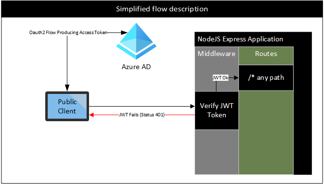
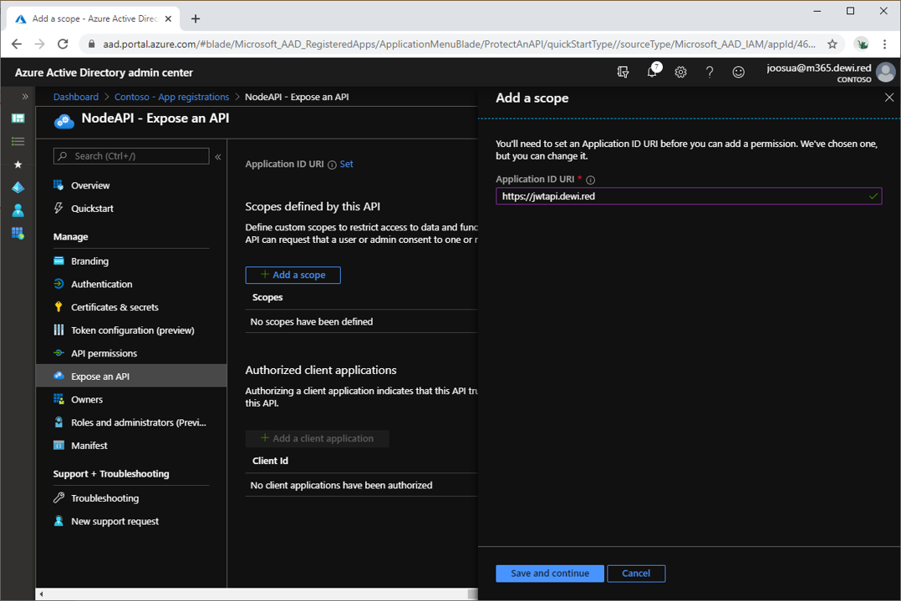
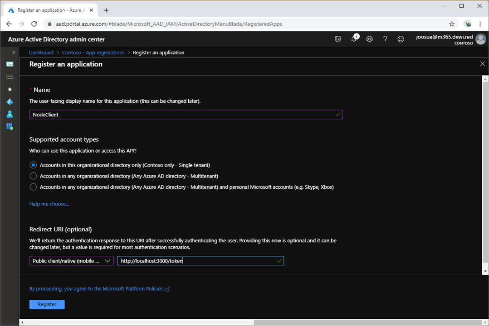
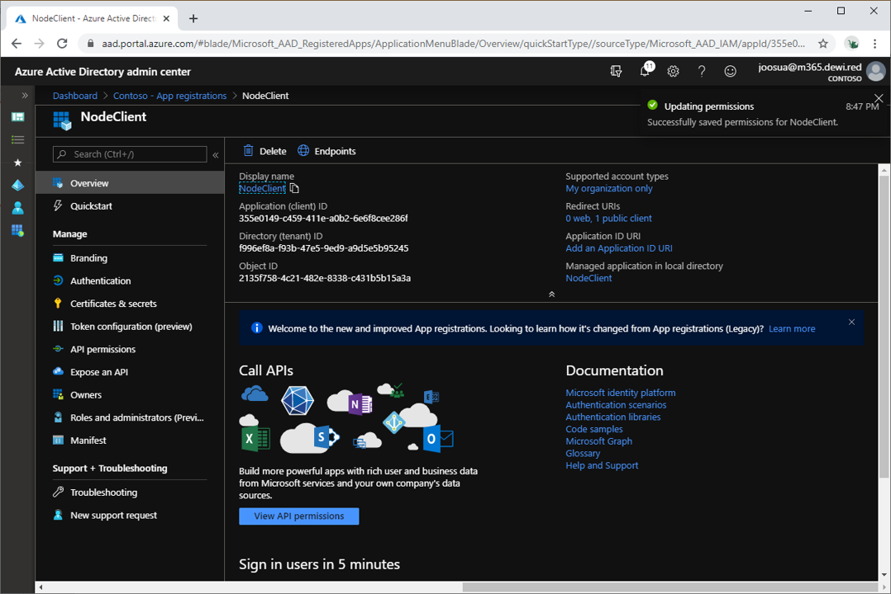
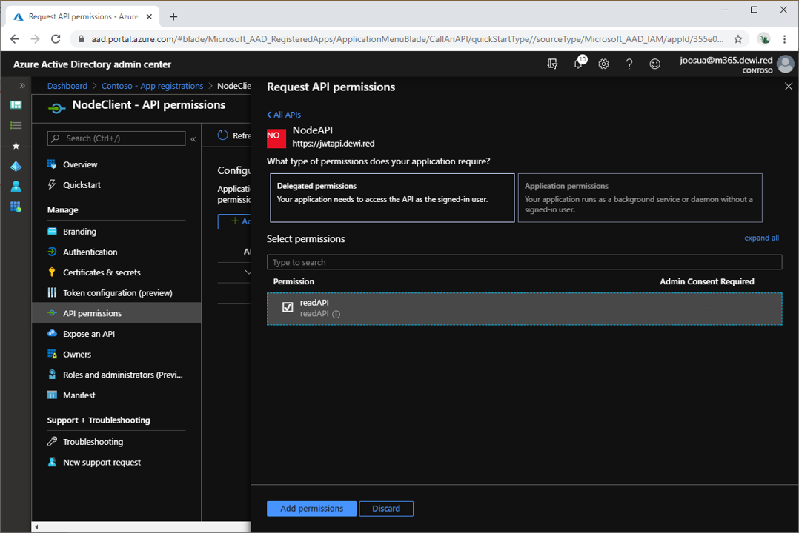

ExpressJS middleware for validating Azure AD JWT tokens on all routes
===
ExpressJS has an middleware building pattern which is suitable for building functions that pre-define conditions, and or manipulate request/response objects. This pattern is evaluated before processing continues to the business logic on route level. 



This pattern is extremely well suited for scenarios where you want the function to cover large part of the application without adding separate logic for each route. Such scenarios might be authorization and logging for example.


 Reason I built this middleware was to understand how to use Azure AD App registration s and JSONWebToken libraries with ExpressJS in a minimal way which achieves the main purpose of the authorization logic. 

Existing solutions recommended for production include incorporating well known NPM modules such PassPortJS (https://github.com/jaredhanson/passport) and/or JWKS-RSA+JSONWebToken. 
This project uses JSONWebToken and replaces JWKS-RSA metadata call with simple request to Azure AD metadata endpoint. The InternalClient code in the project is redundant (50%), but it's there to get somebody testing this library quickly forward.


### Pre-requirements
- Azure AD tenant and permissions to add App registrations
- NodeJS (The installation typically includes NPM)
- VScode (Optional but recommended)
- Recommended: Test the app in Private browsing mode, so it does not use your existing sign-in context (If are part of Office 365 tenant, or maintain other Azure AD related environments)

###  Options
- Below are the options for creating two App registration s, one for the API, and one for the client
- AllowInternalAPIClient if set to true means that the application calls itself with the clientID provided. 
    - AllowInternalAPIClient is demo client built in to the application itself, which wouldn't be actually used in production. If your aiming for a more production-like scenario, keep the AllowInternalAPIClient:false
    - In order to initiate the Authorization Code flow the Middleware allows /token path to be called without the authorization header. 
    - This could also be achieved with single client as AzureAD allows the API to call itself as a client when using the appID as audience. In this scenario especially if youre not using the internalClient, having separate client is much better design pattern as it creates two distinct parties and allows separation of client and application 
- To get going populate the following options from values of the guide starting from step 1:

### Example options (Dont use the same values for TenantID and ClientID)

```javascript
const tenantId = "f996ef8a-f93b-47e5-9ed9-a9d5e5b95245"
const options = {
    audience:"https://jwtapi.dewi.red",
    issuer:"https://sts.windows.net/"+tenantId +"/",
    AllowInternalAPIClient:true,
        clientOptions: {
        ClientId:"cb505207-7698-49e1-8791-40b6eadac75d",
        RedirectUri:"http://localhost:3000/token"
        }
}
```


# How to test
#### 0. Git Clone
- Clone the application from GitHub
#### 1. Register app 'NodeAPI' 
- Leave redirect URI empty 

#### 2. Expose API from 'NodeAPI'
- App Registrations - 
    - Use the 'Add a scope' in selection expose API for the application, and fill in any values for the scope



- Take note of the 'Application ID URI' and populate the audience value from config 
```javascript
    audience:"https://jwtapi.dewi.red",
```


#### 3. Register app 'NodeClient'
- Set the 'Redirect URI' to http://localhost:3000/token
- Ensure that the client is set to **'Public client'**. The demo client doesn't pass client_secret, so if you want to test with confidential client you have to use your own client, and 'AllowInternalAPIClient:false'

- if the client type is set wrong, you will see the following error:

```
Possibly wrong client type: Check that the Client has redirect uri set to public - AzureAD Error:AADSTS7000218: The request body must contain the following parameter: 'client_assertion' or 'client_secret'.
```




#### 4. Add API delegate permissions for the NodeClient with the selection 'Add a permission'

- Name of the API is the API we exposed in step two




#### 5. Complete the config with the following params

- Fill parameters in app.js
```javascript
const tenantId = "Tenant ID From Step 1"
const options = {
    audience:"Application ID URI from Step 2",
    issuer:"https://sts.windows.net/"+tenantId +"/",
    AllowInternalAPIClient:true,
        clientOptions: {
        ClientId:"applicationID From Step 3,
        RedirectUri:"Redirect URI from Step 3"
        }
}
```

### Example from this guide
```javascript
const tenantId = "f996ef8a-f93b-47e5-9ed9-a9d5e5b95245"
const options = {
    audience:"https://jwtapi.dewi.red",
    issuer:"https://sts.windows.net/"+tenantId +"/",
    AllowInternalAPIClient:true,
        clientOptions: {
        ClientId:"355e0149-c459-411e-a0b2-6e6f8cee286f",
        RedirectUri:"http://localhost:3000/token"
        }
}
```

#### 5. Install dependencies and run the example
- browse the directory where the app was downloaded run 'npm install' and then  'npm start'
- Ensure that your not running the tests with user logged in another tenant, as the URL defaults to not prompting if there is existing session


#### 6. Use Any Public Client to get token, or the built-in client
For testing login you can use /aad path (browse http://localhost:3000/token from your browser, this will bring up an consent dialog to the application, unless you did admin grant earlier) 
- /aad path allows the internal client to request authorization code for the exchangeable access token which the middleware will look for other paths

- Upon sucessfull authorization the server echoes the token which was verified. In real scenario this would be any data that the API returns. Echoing of the decoded token is only for educational purposes


#### Recommended after testing 6
Recommended mode is to set the AllowAPIClient:false and use your own client implementation

